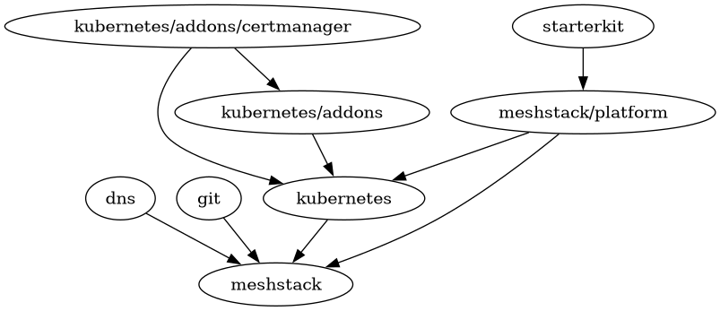

# STACKIT Kubernetes Engine

This contains all resources required to set up STACKIT Kubernetes Engine (SKE).

## State Backend

Existing GCS bucket `meshcloud-tf-states`, prefix `path/to/<module>`. Configured in [tfstate.hcl](tfstate.hcl).

## Apply

Requires a Vault port-forward to `localhost:8200`. Load credentials with `source setup.sh`, then apply:

```bash
terragrunt run --all apply
```

Terragrunt resolves the dependency order automatically. To target a single module: `cd <module> && terragrunt apply`, e.g. `cd kubernetes && terragrunt apply`.
Use the graph in section [Module Dependencies](#module-dependencies) to know which modules need to be applied first.

## Terragrunt Dependencies

* `meshstack/platform` separate from `meshstack` as it needs `kubernetes`.
* `kubernetes/addons/certmanager` exists as adding the `ClusterIssuer` custom resource needs the CRD from `kubernetes/addons/certmanager.tf`.



Helps in knowing order of execution (arrow = depends on).
Generate the graph with: `terragrunt dag graph | dot -Tpng > dep.png`

## Access Kubernetes cluster

To access the cluster, use the `stackit` CLI tool. Run:

```bash
stackit auth login

stackit config set --project-id 47787660-94b9-4fb6-8bf7-53a90c41b26a
stackit ske kubeconfig create starterkit --login
```
