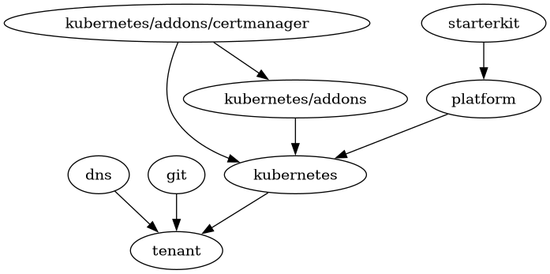

# STACKIT Kubernetes Engine

This contains all resources required to set up STACKIT Kubernetes Engine (SKE).

## State Backend

Existing GCS bucket `meshcloud-tf-states`, prefix `path/to/<module>`. Configured in [tfstate.hcl](tfstate.hcl).

## Apply

Requires a Vault port-forward to `localhost:8200`. Load credentials with `source setup.sh`, then apply:

```bash
terragrunt run --all apply
```

Terragrunt resolves the dependency order automatically. To target a single module: `cd <module> && terragrunt apply`, e.g. `cd kubernetes && terragrunt apply`.
Use the graph in section [Module Dependencies](#module-dependencies) to know which modules need to be applied first.

## Terragrunt Dependencies

* `meshstack/platform` separate from `meshstack` as it needs `kubernetes`.
* `kubernetes/addons/certmanager` exists as adding the `ClusterIssuer` custom resource needs the CRD from `kubernetes/addons/certmanager.tf`.



Helps in knowing order of execution (arrow = depends on).
Generate the graph with: `terragrunt dag graph | dot -Tpng > dep.png`

## Access Kubernetes cluster

To access the cluster, use the `stackit` CLI tool. Run:

```bash
stackit auth login

stackit config set --project-id 47787660-94b9-4fb6-8bf7-53a90c41b26a
stackit ske kubeconfig create starterkit --login
```

## Container Images (one-time manual setup)

Starterkit templates build on base images pulled from our Harbor project, not from Docker Hub.
Mirroring those base images is **manual, one-time setup** — not managed by Terragrunt.

Harbor could do this itself via a proxy cache project or a replication rule, but the Harbor project
is shared across all STACKIT customers and we only hold robot credentials, no admin rights. Ask
STACKIT support if you want this automated.

To mirror an image:

```bash
source setup-env.sh # from the repo root, exports the Harbor push robot credentials
./mirror-image.sh docker.io/library/python:3.12.9-slim-bookworm
```

Already mirrored:

| Upstream                                       | Used by                          |
|------------------------------------------------|----------------------------------|
| `docker.io/library/python:3.12.9-slim-bookworm` | `ai-summarizer` starterkit template |
