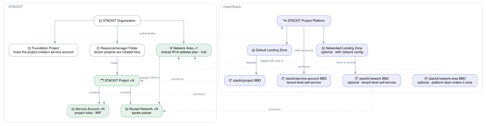

# STACKIT Landing Zone

## Overview

The **STACKIT Landing Zone** reference architecture turns a bare STACKIT organization into a
self-service-ready meshStack platform in one step using its own Terraform code.

The **always-on** foundation is a sandbox landing zone: a dedicated STACKIT resourcemanager
folder, a foundation project hosting the project-creation service account, and the **STACKIT
Project** platform with its default landing zone. Application teams can immediately request
STACKIT projects against it.

Optionally, by providing a **network** configuration, the same building block layers on a
hub-and-spoke network topology with IPAM built in: a shared network-area address plan (the hub)
that all tenant projects draw from, and a self-service routed-network building block (the spoke)
application teams can order inside their own projects. Leaving the network configuration unset
deploys only the sandbox foundation.

**Target audience:**

- **Platform engineers** onboarding a new STACKIT organization into meshStack who want a sandbox
  environment application teams can request projects from immediately — optionally with network
  segmentation from day one, without hand-wiring a network area and its address plan separately.
- **Application teams** who need a dedicated IPv4 subnet inside their STACKIT project without
  manually coordinating CIDR ranges with the platform team (when networking is enabled).

## Architecture Diagram

The left half of the diagram is the **STACKIT resource hierarchy** — the organization, the
resourcemanager folder tenant projects land in, the foundation project holding the project-creation
service account, and the org-level network area. The right half is **meshStack**: the platform, its
landing zones and the building block **definitions** (BBDs). Dotted edges across the boundary show
how each meshStack construct maps onto a STACKIT one. Definitions (blue) are registered once;
**instances** (green) are ordered against them — the hub network area is a single instance the
platform team orders, while STACKIT projects and spoke networks are ordered `N` times by application
teams. Everything marked *optional* only appears when a network configuration is provided.

When networking is enabled, application teams order a routed network into their own project via the
self-service `stackit/network` building block; each order draws its subnet from the hub's address
plan, so no two spokes can accidentally collide on CIDR ranges.

## How It Works

Running this reference architecture always:

1. Creates a **STACKIT resourcemanager folder** under the given organization — new STACKIT
   projects are created inside this folder.
2. Creates a **STACKIT foundation project** directly under the organization to host the
   project-creation service account and other landing-zone core assets.
3. Sources the [`modules/stackit`](../../modules/stackit) platform integration to register the
   **STACKIT Project** platform and its default landing zone in meshStack, wired to the foundation
   service account.
4. Registers the [`stackit/service-account`](../../modules/stackit/service-account) building block
   definition (`TENANT_LEVEL`) so application teams can self-service create a STACKIT service account
   — with project roles and optional workload identity federation — inside their own projects.

When a **network** configuration is provided, it additionally:

5. Registers the [`stackit/network-area`](../../modules/stackit/network-area) building block
   definition and immediately orders **one instance** of it in the platform team's own workspace —
   this is the hub's IPv4 address plan.
6. Registers the [`stackit/network`](../../modules/stackit/network) building block definition
   (`TENANT_LEVEL`) so application teams can self-service order routed networks (spokes) inside
   their STACKIT projects, drawing from the hub's address plan.
7. Provisions an additional **networked project definition and landing zone**. The networked
   `STACKIT Project` building block definition carries the hub's network area ID as a static
   `networkArea` label, so new STACKIT projects created against that landing zone are placed in the
   hub's network area.

## Service Accounts

You supply one account, as `stackit_service_account_key`, and the architecture creates another. The
account you supply creates the folder, the foundation project and the meshStack objects, and its key
is reused on every run rather than only the first. The account it creates lives in the foundation
project and is what creates tenant projects; it authenticates through workload identity federation,
so no key for it is ever stored.

`stackit_owner_email` owns the folder, the foundation project and every tenant project the platform
creates. STACKIT applies it at creation only, so changing it later means recreating what it owns.

The key you supply is expected to be an organization owner, which may name any address — a team
mailbox, typically. A key holding only `resource-manager.admin` may create a project but not act
inside one it does not own, so with such a key the owner has to be that account's own address, or
the run fails with `POST /v2/projects/<id>/service-accounts -> 403`.

Tenant projects are unaffected either way: the tenant-project account works through its
organization-scoped roles, not through ownership. One of those roles is conditional — with
`stackit_organization_onboarding_enabled` off it lacks `iam.member-admin` and cannot assign project
roles to users.

## Getting Started

### Prerequisites

| Requirement          | Description                                                                       |
|----------------------|-----------------------------------------------------------------------------------|
| STACKIT organization | With an organization-owner service account key. `resource-manager.admin` alone also works, but then constrains which `stackit_owner_email` values are valid — see [Service Accounts](#service-accounts). |
| CIDR plan            | *(Only when enabling networking)* A non-overlapping IPv4 address plan chosen up front for the hub network ranges and transfer network. |

### Deployment Order

Order the **STACKIT Landing Zone** building block once per workspace. Without a network
configuration it creates the platform and default landing zone. With a network configuration it
additionally creates the hub network area instance, the networked project definition and landing zone, and registers the
spoke `stackit/network` building block in the same apply. Application teams can then request
projects and — when networking is enabled — order `stackit/network` inside their own STACKIT
projects once those projects exist.

### Playground Mode

`playground_mode` defaults to `true`, so an unconfigured deployment is a throwaway one. Two things
change with it:

| | `playground_mode = true` | `playground_mode = false` |
|---|---|---|
| Platform identifier | random suffix appended | taken exactly as given |
| Landing-zone folder and foundation project | destroyable | guarded with `prevent_destroy` |

The suffix exists because a platform identifier is unique across the whole meshStack instance, and
`modules/stackit` builds every landing zone name from it as `<platform_identifier>-<variant>`. A
playground deployment that took the plain name would occupy it for good, across the instance.

**A playground platform is for the deploying workspace only.** Neither it nor the building block
definitions it registers should be published to other workspaces: the platform can disappear at any
time, and its name is not the one a real deployment will use.

Set `playground_mode = false` for a platform that is actually used, as the `stackit-platform`
workspace in likvid-cloudfoundation does. The guard is then a plan-time rule, so it also catches a
teardown caused by a change that forces the folder to be replaced. It cannot catch a deletion that
happens outside the Terraform run, such as someone removing the folder in the STACKIT portal.

The flag belongs to whoever deploys the definition, not to whoever orders it. It reaches the
building block as a `STATIC` input, so it does not appear as a choice in the order form and a
consumer cannot turn a real platform into a playground one, or the reverse. Change it by setting
`playground_mode` on the reference architecture module and deploying a new definition version.

### Approval Gates

`approval_policies` sets which run triggers need an operator's approval before a run of this
architecture is applied; `starterkit_approval_policies` does the same for the project starterkit
definition it registers. Both default to no gate at all.

## Shared Responsibilities

| Responsibility                                                                | Platform Team | Application Team |
|-------------------------------------------------------------------------------|:---:|:---:|
| Provision the STACKIT platform and default landing zone                       | ✅ | ❌ |
| Register the self-service `stackit/service-account` building block            | ✅ | ❌ |
| *(Optional)* Provision the hub network area and choose its address plan       | ✅ | ❌ |
| *(Optional)* Register the spoke `stackit/network` building block              | ✅ | ❌ |
| Request STACKIT projects through the landing zone                             | ❌ | ✅ |
| Create service accounts inside their STACKIT projects                         | ❌ | ✅ |
| *(Optional)* Order spoke networks inside their STACKIT projects               | ❌ | ✅ |
| Use the assigned subnet and manage workloads inside their projects            | ❌ | ✅ |
